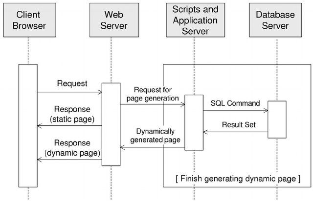
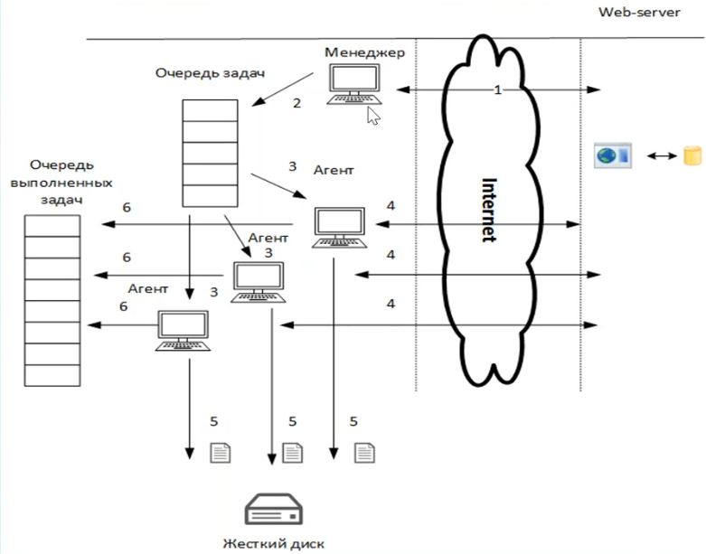

# HTTP Requests

### Data scraping

*[Sequence diagram of a Web application.](https://ieeexplore.ieee.org/document/1423991)*

##

### HTTP Request

- Verb - Indicates the HTTP methods such as GET, POST, DELETE, PUT, etc.
- URI - Uniform Resource Identifier (URI) to identify the resource on the server.
- HTTP Version - Indicates the HTTP version. For example, HTTP v1.1.
- Request Header - Contains metadata for the HTTP Request message as key-value pairs. For example, client (or browser) type, format supported by the client, format of the message body, cache settings, etc.
- Request Body - Message content or Resource representation.

### HTTP Response

- Status/Response Code - Indicates the Server status for the requested resource. For example, 404 means resource not found and 200 means response is ok.
- HTTP Version - Indicates the HTTP version. For example HTTP v1.1.
- Response Header - Contains metadata for the HTTP Response message as keyvalue pairs. For example, content length, content type, response date, server type, etc.
- Response Body - Response message content or Resource representation.

### HTTP status codes

- 200	OK - shows success.
- 201	CREATED - when a resource is successfully created using POST or PUT request. Returns link to the newly created resource using the location header.
- 204 NO CONTENT - when response body is empty. For example, a DELETE request.
- 304 NOT MODIFIED - used to reduce network bandwidth usage in case of conditional GET requests. Response body should be empty. Headers should have date, location, etc.
- 400	BAD REQUEST - states that an invalid input is provided. For example, validation error, missing data.
- 401	UNAUTHORIZED - states that user is using invalid or wrong authentication token.
- 403	FORBIDDEN - states that the user is not having access to the method being used. For example, Delete access without admin rights.
- 404	NOT FOUND - states that the method is not available.
- 409 CONFLICT - states conflict situation while executing the method. For example, adding duplicate entry.
- 500 INTERNAL SERVER ERROR - states that the server has thrown some „exception while executing the method.

### HTTP tools
1. JSON formatting online: http://json.parser.online.fr/beta/
2. Burp suite: [portswigger](https://portswigger.net/burp/community-download-thank-you)
3. Postman: [Clickup API example](https://www.postman.com/gold-spaceship-149282/workspace/dev/folder/9044075-5b1c4102-5b5b-4579-9ceb-af27b3438d72)
4. RestLet
5. Apitester
6. Insomnia

## Parallel Requests

### Test server
[JsonPlaceHolder](https://jsonplaceholder.typicode.com/posts)

## Seminar Materials
1. [basic requests](https://drive.google.com/file/d/1C_h59FL0_6--TqPgMZYGzV6sxvUU9EaR/view?usp=sharing)
2. [Beautifulsoup: simple](https://colab.research.google.com/drive/1Hhy8ZVzgLhyw91wo46ivklWYNDzghnWd)
3. [Beautifulsoup: find by class](https://drive.google.com/file/d/10BN7w9waaKNy2rcifqNckb-d0OPNfdpq/view?usp=sharing)
4. [Beautifulsoup: find by regual expression](https://drive.google.com/file/d/1ia-N1tYQmOv8X1ZsXf4TUAv9Uaq2K6D3/view?usp=sharing)
5. [image download](https://drive.google.com/file/d/1jnd4VzzwU9B_BCqIxJqI45v-MEUuD7ab/view?usp=sharing)
6. [regex manual](https://drive.google.com/file/d/1wDMzkeg4RQgyNKQTIE71MhClMbh8T6vt/view?usp=sharing)

### References
* Ryan Mitchell, **Web Scraping with Python - Collecting More Data from the Modern Web** [pdf](https://edu.anarcho-copy.org/Programming%20Languages/Python/Web%20Scraping%20with%20Python,%202nd%20Edition.pdf)

