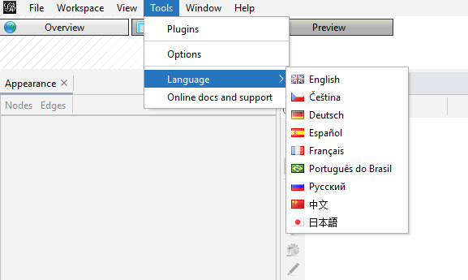

# Seminar 01 - Introduction to network visualization tools

## Prerequisites
* Please install gephi https://gephi.org/users/download/ for today's seminar and set up English Language.

## Materials
* NetworkX [colab](https://colab.research.google.com/drive/1f-j5Zum7M-gjEdpR7AzXZcCDs17294Ei?usp=sharing)
 
 ### Data
* [edges](https://dl.dropboxusercontent.com/s/39k4aj05dbkbz8g/edges.csv) 
* [nodes](https://dl.dropboxusercontent.com/s/jt3fie6aedewirf/nodes.tsv) 